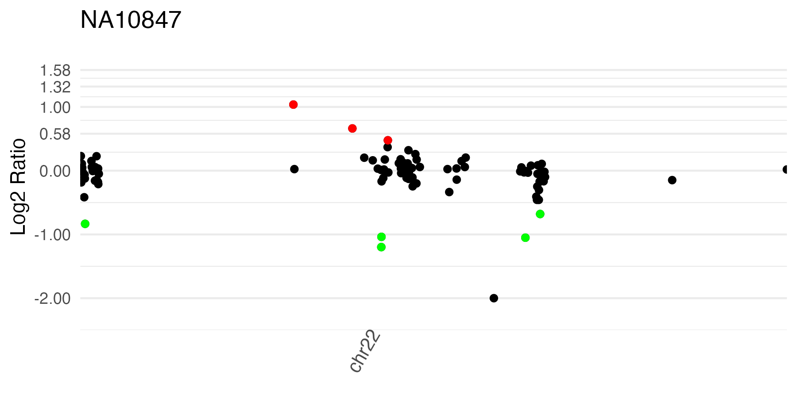

# HMZDupFinder vignette 

#### Haowei Du, <haoweid@bcm.edu>

#### 2023-04-11 {#section .date}

# Install the package from github

``` {.r}
# require devtools
install.packages("devtools")
devtools::install_github("cluhaowie/HMZDupFinder")
devtools::install_github("cluhaowie/VizCNV/SLMSeg")
```


## Or use Docker:
``` bash
docker run -it --rm tgambin/hmzdupfinder-image:v1 /bin/bash
```

## run on public availiable samples
``` r

# Prepare the normalized read depth

``` {.r}
library(HMZDupFinder)
library(IRanges)

library(WES.1KG.WUGSC)
library(BSgenome.Hsapiens.UCSC.hg19)
library(dplyr)
library(data.table)

ref.genome <- BSgenome.Hsapiens.UCSC.hg19
dirPath1 <- system.file("extdata", package = "HMZDupFinder")
dirPath2 <- system.file("extdata", package = "WES.1KG.WUGSC")
outputDir <- "./output/"
bamFiles <- list.files(dirPath2, pattern = '*.bam$',full.names = T)
sampname <- as.character(unlist(read.table(file.path(dirPath2, "sampname"))))
bedFile <- file.path(dirPath1, "chr22_400_to_500.bed")
## prepare bed file
bedOrdered <- prepareBed(bedFile,ref.genome = ref.genome)

## calculate TPM
calcTPMsFromBAMs(bedOrdered,bamFiles,sampname,outputDir,mc.cores = 1)

## generate TPM data frame
tpmFile <- list.files(outputDir,pattern = "*tpm.bed$",full.names = T)
tpmDtOrdered <- prepareTPMData(tpmFile,mc.cores = 2)

## compare the TPM profile to identify reference st
perMat <- cor(tpmDtOrdered,method = "pearson")

## write out the Z-TPM and log2 ratio
CalcuZtpm(perMat,tpmDtOrdered,bedOrdered,outputDir,mc.cores = 4)
```

# Call dups with custom defined parameters

``` {.r}
## call homozygous duplication with fine-tune cut-off
hmzdup.seg.mean <- c(0.85,1.15)
ztpm.mean.cutoff <- 1.5 ## with the optimized ztpm cutoff(>4.0), there are no call in the toy data set, here set 1.5 to get the low confidence call

## get all hmz dup call 
ztpmFile <- list.files(outputDir,pattern = "*ztpm.ratio.bed",full.names = T)
tmplist <- lapply(sampname,function(i){
  file <- paste0(outputDir,i,".ztpm.ratio.bed")
  print(i)
  df <- fread(file,stringsAsFactors = F)
  seg <- tryCatch({
    SegNormRDES(df,i,seg.method="slm")
  },error=function(e){
    return(i)
  })
  if(!is.data.frame(seg)){
    return(seg)
  }else{
    hmzdup <- seg%>%
      mutate(cnv=ifelse(dplyr::between(seg.mean,hmzdup.seg.mean[1], hmzdup.seg.mean[2])&ztpm.mean>ztpm.mean.cutoff,"hmzdup","else"))%>%
      filter(cnv=="hmzdup")
    return(hmzdup)
  }
  
})
```

    ## [1] "NA06994"
    ## [1] "segment with SLM"
    ## [1] "NA10847"
    ## [1] "segment with SLM"
    ## [1] "NA11840"
    ## [1] "segment with SLM"
    ## [1] "NA12249"
    ## [1] "segment with SLM"
    ## [1] "NA12716"
    ## [1] "segment with SLM"
    ## [1] "NA12750"
    ## [1] "segment with SLM"
    ## [1] "NA12751"
    ## [1] "segment with SLM"
    ## [1] "NA12760"
    ## [1] "segment with SLM"
    ## [1] "NA12761"
    ## [1] "segment with SLM"
    ## [1] "NA12763"
    ## [1] "segment with SLM"
    ## [1] "NA18966"
    ## [1] "segment with SLM"
    ## [1] "NA18967"
    ## [1] "segment with SLM"
    ## [1] "NA18968"
    ## [1] "segment with SLM"
    ## [1] "NA18969"
    ## [1] "segment with SLM"
    ## [1] "NA18970"
    ## [1] "segment with SLM"
    ## [1] "NA18971"
    ## [1] "segment with SLM"
    ## [1] "NA18972"
    ## [1] "segment with SLM"
    ## [1] "NA18973"
    ## [1] "segment with SLM"
    ## [1] "NA18974"
    ## [1] "segment with SLM"
    ## [1] "NA18975"
    ## [1] "segment with SLM"
    ## [1] "NA18976"
    ## [1] "segment with SLM"
    ## [1] "NA18981"
    ## [1] "segment with SLM"
    ## [1] "NA18987"
    ## [1] "segment with SLM"
    ## [1] "NA18990"
    ## [1] "segment with SLM"
    ## [1] "NA18991"
    ## [1] "segment with SLM"
    ## [1] "NA19098"
    ## [1] "segment with SLM"
    ## [1] "NA19119"
    ## [1] "segment with SLM"
    ## [1] "NA19131"
    ## [1] "segment with SLM"
    ## [1] "NA19137"
    ## [1] "segment with SLM"
    ## [1] "NA19138"
    ## [1] "segment with SLM"
    ## [1] "NA19141"
    ## [1] "segment with SLM"
    ## [1] "NA19143"
    ## [1] "segment with SLM"
    ## [1] "NA19144"
    ## [1] "segment with SLM"
    ## [1] "NA19152"
    ## [1] "segment with SLM"
    ## [1] "NA19153"
    ## [1] "segment with SLM"
    ## [1] "NA19159"
    ## [1] "segment with SLM"
    ## [1] "NA19160"
    ## [1] "segment with SLM"
    ## [1] "NA19171"
    ## [1] "segment with SLM"
    ## [1] "NA19200"
    ## [1] "segment with SLM"
    ## [1] "NA19201"
    ## [1] "segment with SLM"
    ## [1] "NA19204"
    ## [1] "segment with SLM"
    ## [1] "NA19206"
    ## [1] "segment with SLM"
    ## [1] "NA19207"
    ## [1] "segment with SLM"
    ## [1] "NA19209"
    ## [1] "segment with SLM"
    ## [1] "NA19210"
    ## [1] "segment with SLM"
    ## [1] "NA19223"
    ## [1] "segment with SLM"

# Get calls from all samples
``` {.r}
dupcall <- rbindlist(tmplist)
dupcall
```

    ##         ID chrom loc.start  loc.end num.mark  seg.mean ztpm.mean    cnv
    ## 1: NA10847 chr22  21797070 21799161        1 1.0369728  2.383095 hmzdup
    ## 2: NA12249 chr22  21921983 21947100        1 0.9437214  1.598907 hmzdup
    ## 3: NA18969 chr22  21356071 21369444        1 1.0549529  1.890923 hmzdup
    ## 4: NA18971 chr22  21987420 21988261        1 1.0836136  1.781615 hmzdup
    ## 5: NA18974 chr22  21987420 21988261        1 0.9754562  1.537753 hmzdup
    ## 6: NA19119 chr22  21356071 21369444        1 0.9044307  1.529398 hmzdup
    ## 7: NA19144 chr22  21797070 21799161        1 0.9033155  1.971388 hmzdup

# Visualize the normalized read depth

``` {.r}
library(ggplot2)
library(dplyr)
library(stringr)
scale_rd <- scale_y_continuous(name="Log2 Ratio",
                                 limits=c(-2.5, 2),
                                 breaks = c(-2,
                                            round(log2(1/2),2),
                                            round(log2(2/2),2),
                                            round(log2(3/2),2),
                                            round(log2(4/2),2),
                                            round(log2(5/2),2),
                                            round(log2(6/2),2)
                                 ))
wg_ratio2plot <- function(df,id){
  temp <- df %>% 
    group_by(seqnames) %>% 
    summarise(max_end = max(end)) %>% 
    mutate(across("seqnames", str_replace, "chr", "")) %>% 
    arrange(as.numeric(seqnames)) %>% 
    mutate(loc_add = lag(cumsum(as.numeric(max_end)), default = 0)) %>% 
    mutate(seqnames = paste0("chr", seqnames))%>%
    mutate(loc_end=loc_add+max_end)

  para.label <- paste0(id)

  df <- df%>%mutate(log2ratio=log2(ratio+0.001))%>%
    mutate(log2ratio=ifelse(log2ratio < -2.5,-2,log2ratio))
  df <- df %>% 
    inner_join(temp, by = "seqnames") %>% 
    mutate(end_cum = loc_add + end) 
  df <- df %>% 
    mutate(start_cum = loc_add+start)
  axis_set <- df %>% 
    group_by(seqnames) %>% 
    summarize(center = mean(end_cum)) %>% 
    arrange((seqnames))

  label_seg_gain <- df %>% 
    filter(dplyr::between(log2ratio,log2(3/2)-0.2,log2(3/2)+0.5))
  label_seg_loss <- df %>% 
    filter(dplyr::between(log2ratio,log2(1/2)-0.5,log2(1/2)+0.5))
  
  wg <-  
    ggplot()+
    geom_point(data=df,aes(x = start_cum, y = log2ratio))+
    geom_point(data = label_seg_gain,aes(x = start_cum, y = log2ratio), color = "red")+
    geom_point(data = label_seg_loss,aes(x = start_cum, y = log2ratio), color = "green")+
    #geom_rect(data = temp[seq(1,24,2),],aes(xmin=loc_add,xmax=loc_end,ymin=-2,ymax=1.58),alpha = 0.3)+
    #geom_point(data = label_seg_gain, shape = 8, color = "red")+
    #geom_point(data = label_seg_gain.sig, shape = 8, color = "blue")+
    #geom_point(data = label_seg_loss, shape= 8, color = "green")+
    theme_minimal() +
    theme( 
      legend.position = "none",
      panel.grid.major.x = element_blank(),
      panel.grid.minor.x = element_blank(),
      axis.text.x = element_text(angle = 60, size = 10, vjust = 0.8)
    )+
    scale_rd+
    #scale_size_continuous(range = c(0.5,3))+
    labs(x = NULL)+
    scale_colour_manual(values = c("orange", "purple"))+
    scale_x_continuous(label = axis_set$seqnames, breaks = axis_set$center)+
    coord_cartesian(expand = F)+
    ggtitle(para.label)
  return(wg)
}
df <- fread("output/NA10847.ztpm.ratio.bed",stringsAsFactors = F)
wg_ratio2plot(df,"NA10847")
```

